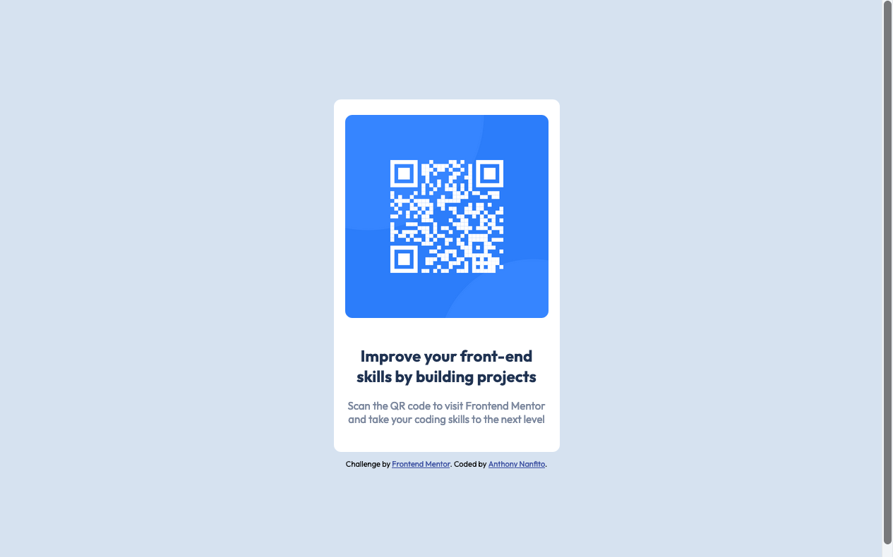

# Frontend Mentor - QR code component solution

This is a solution to the [QR code component challenge on Frontend Mentor](https://www.frontendmentor.io/challenges/qr-code-component-iux_sIO_H). Frontend Mentor challenges help you improve your coding skills by building realistic projects.

## Table of contents

- [Overview](#overview)
  - [Screenshot](#screenshot)
  - [Links](#links)
- [My process](#my-process)
  - [Built with](#built-with)
  - [What I learned](#what-i-learned)
  - [Continued development](#continued-development)
- [Author](#author)

## Overview

A static webpage with a QR code component. This challenge came from [Frontend Mentor](https://www.frontendmentor.io) - a place to help you improve your coding skills by building realistic projects.

### Screenshot

### Links

- Solution URL: [https://github.com/ananfito/frontend-mentor/tree/main/qr-code-component-main](https://github.com/ananfito/frontend-mentor/tree/main/qr-code-component-main)
- Live Site URL: [https://ananfito.github.io/qr-code-component/](https://ananfito.github.io/qr-code-component/)

## My process

I started with the HTML file and built out the sections of the webpage starting with a `div` container for the image and text. Then I created a `div` specifically for the text. After that I moved on to styling. I opted to use flexbox to center the content vertically and horizontally, then used custom styling to create the appropriate rounded corners and font colors.

### Built with

- Semantic HTML5 markup
- CSS custom properties
- Flexbox
- Mobile-first workflow

### What I learned

For the most part, this challenge was a review exercise for me. Regardless, I did have a **big takeaway**: when using flexbox and centering content vertically you need to set the `height` parameter of the `body` to `100vh`. This is something I initially forgot to include in my styling sheet. It caused some frustration but I continued to style project until the very end I had to figure it out. Thankfully, I reviewed an old project where I accomplished the same goal and that's when I saw the `height: 100vh` which reminded me what I was missing.

### Continued development

While this was a review exercise for me, I do want to continue practicing my frontend skills. Specifically, I want to continue practicing HTML and CSS so they become second nature, then later incorporate more JavaScript. 

## Author

- Website - [Anthony Nanfito](https://ananfito.github.io)
- Frontend Mentor - [@ananfito](https://www.frontendmentor.io/profile/ananfito)
- Twitter - [@wordsbyfifi](https://www.twitter.com/wordsbyfifi)
